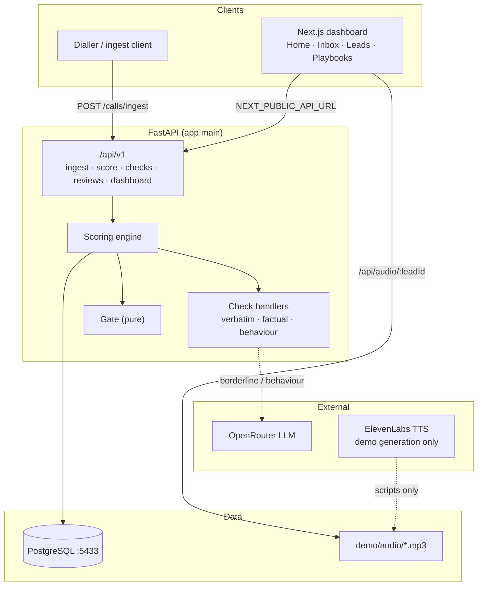
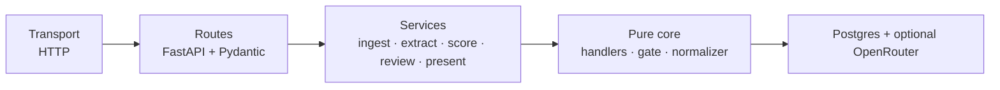
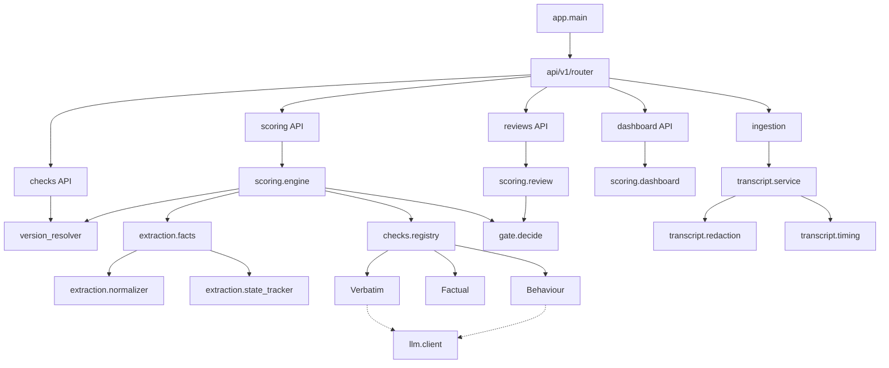
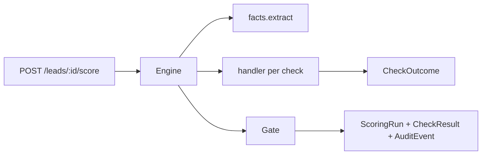
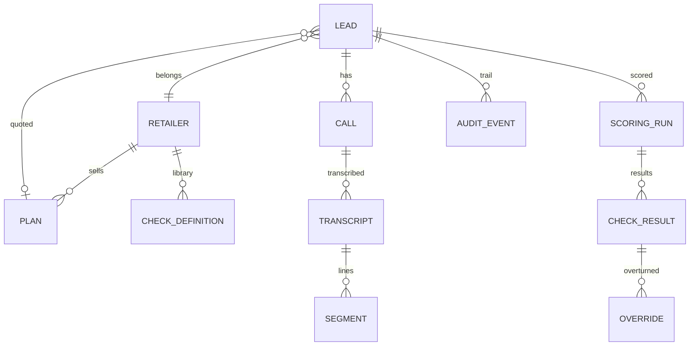
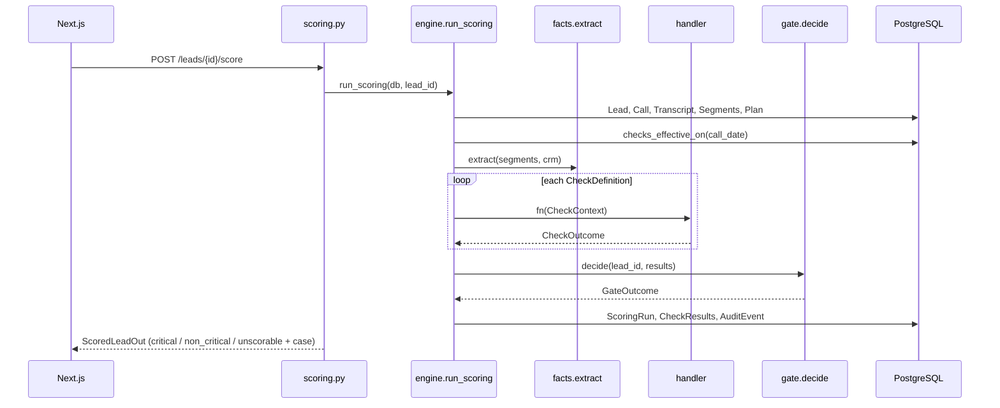
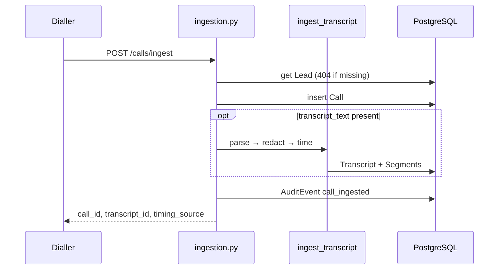
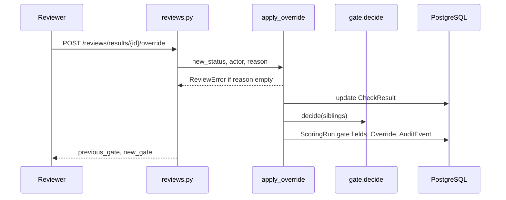
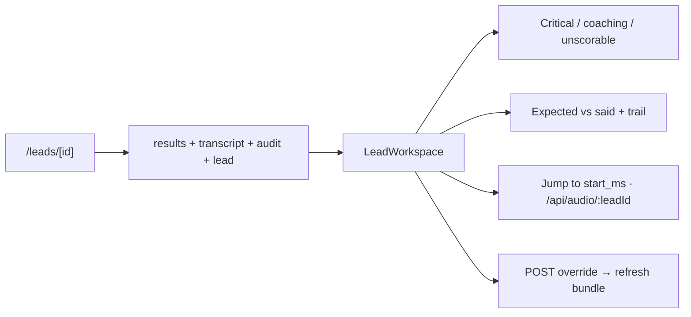

# QA Gate — Architecture

> System architecture for the FastAPI scoring API + Next.js workspace.
> Companion to [[01 Project/Overview]].

---

## 1. High Level Diagram



### Layered view



The overview (`backend/overview/1.md`) drew six product modules. We kept that split in code:

```
1. Ingestion
2. Transcript
3. Check Library
4. Scoring Engine
5. Gate / Review Workflow
6. Dashboard
```

Plus extraction (the piece overview/2.md added after reading the messy transcript): **state tracker + normalizer**.

---

## 2. Module Dependency Graph

Arrows mean **imports** (A → B = A depends on B).



### Dependency notes

| Pattern | Why |
|---------|-----|
| Handlers are a registry, not a class hierarchy | Adding a check is a `config.handler` string |
| Extraction runs once per scoring run | Two checks cannot disagree about what the call said |
| Gate is a pure function of `(lead_id, results)` | Overrides re-run the same function |
| LLM is a leaf | Returns `None`; callers degrade to REVIEW |
| `present.py` sits at the API edge | Human labels without polluting handlers |

### Hot path (runtime critical)



---

## 3. Mermaid — Domain Model



---

## 4. Data Flow

### 4.1 Score (end-to-end)



### 4.2 Ingest



### 4.3 Override



### 4.4 Lead workspace (UI)



---

## 5. Folder Explanation

```
qt-gate/
├── backend/
│   ├── app/
│   │   ├── main.py                 # FastAPI + CORS + /health
│   │   ├── core/                   # config, db session, enums
│   │   ├── models/                 # SQLAlchemy entities
│   │   ├── schemas/                # Pydantic contracts
│   │   ├── api/v1/                 # HTTP surface
│   │   ├── services/
│   │   │   ├── transcript/         # parser, redaction, timing, ingest
│   │   │   ├── extraction/         # normalizer, facts, state_tracker
│   │   │   ├── checks/             # registry + three families
│   │   │   ├── llm/                # OpenRouter JSON client
│   │   │   ├── scoring/            # engine, versions, review, dashboard
│   │   │   ├── gate/               # decide()
│   │   │   └── present.py          # UI labels
│   │   └── seed/                   # fixtures + CLI
│   ├── overview/                   # hackathon briefs (not runtime)
│   ├── scripts/                    # dry_run, demo audio, verify sync
│   └── tests/
├── web/
│   ├── app/                        # pages + audio proxy
│   ├── components/                 # shell, workspace, UI
│   └── lib/                        # api.ts, types.ts
└── knowledge/                      # this vault
```

---

## 6. Best Practices

### Architecture principles already in use

1. **Ingestion before scoring** — `ScoringError` if no call/transcript/segments.
2. **Extract once** — `FactStore` is shared; handlers do not re-parse the call.
3. **Handlers report, gate decides** — status/confidence/evidence in, decision out.
4. **Deterministic first, model last** — [[08 Decisions/ADR-001 Deterministic first model last]].
5. **Fail closed on LLM** — [[08 Decisions/ADR-002 Unavailable LLM cannot ship a sale]].
6. **Latest assertion wins** — [[08 Decisions/ADR-003 Conversation state not first occurrence]].
7. **Unscorable ≠ fail** — [[08 Decisions/ADR-004 Missing input is NOT_APPLICABLE]].
8. **Version by call date** — [[08 Decisions/ADR-005 Call date picks check version]].
9. **Identify, do not rewrite** — no auto-correction of the sale.
10. **Overrides are first-class** — reason required; gate re-run; audit written.

### Recommended practices when extending

| Area | Do | Avoid |
|------|----|-------|
| New check | Row in `seed/data/checks.py` + `@handler("name")` | Hardcoding expected values in the handler |
| New fact | Add extractor in `facts.py` + normalizer if ASR-noisy | Sending the raw transcript to the LLM for a price |
| New API | Pydantic schema in `schemas/common.py` | Returning `Segment.raw_text` |
| New UI page | Fetch via `web/lib/api.ts`, `force-dynamic` | Client-side caching of scores |
| Timings | Prefer ASR payload; always set `timing_source` | Presenting estimates as measurements |
| Docs | Update `knowledge/` when modules change | Trusting README paths (`qa-gate/` vs `backend/`) |

### Cross-cutting concerns checklist

- [ ] Handler never writes to DB
- [ ] Gate never reads transcript
- [ ] Evidence includes timestamp + `timing_source`
- [ ] LLM failure path returns REVIEW
- [ ] Override has a reason and re-runs `decide()`
- [ ] Env vars added to `Settings` + `.env.example`

---

## Related

- [[01 Project/Overview]] — product / judging / seed leads
- `backend/README.md` — setup
- Swagger — http://localhost:8000/docs
