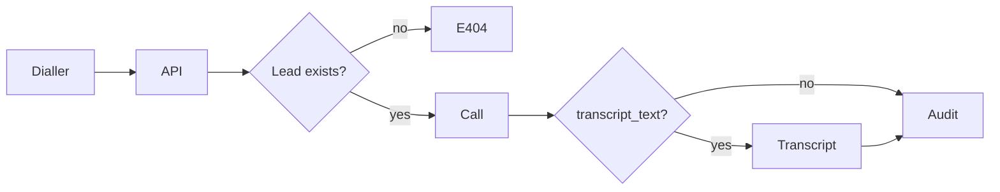

# Ingestion Module

> Path: `backend/app/api/v1/ingestion.py`  
> Related: [[03 Modules/Transcript]], [[05 APIs/Route Map]]

---

## Purpose

The pipeline everything else depends on. A dialler (or seed) posts a Lead ID + recording metadata + optional transcript. The module creates a `Call` and, if text is present, a timed redacted `Transcript`. Scoring refuses to run without this.

Matches overview/1.md **Module 1**: `POST /api/calls/ingest` — do not build a custom STT model.

---

## Entry points

| Method | Path | Notes |
|--------|------|-------|
| `POST` | `/api/v1/calls/ingest` | 201; Lead must exist |
| `GET` | `/api/v1/leads/{lead_id}/transcript` | Redacted segments |

Queues: none (synchronous).

---

## Services

**`ingest_transcript`** (`services/transcript/service.py`) — parse → redact → time → persist segments.

---

## Flow

1. Load Lead or 404 (`Load the lead first`).
2. Insert `Call` (`status=ingested`).
3. If `transcript_text`: ingest, set `status=transcribed`.
4. Write `AuditEvent` `call_ingested`.
5. Return `call_id`, `transcript_id`, segment count, `diarization_reliable`, `timing_source`.

## Future Improvements

1. Transcription callback that posts after ASR finishes (schema already allows omitting text).
2. Persist real `recordingUrl` objects instead of seed `s3://` strings.
3. Auth on ingest (currently open).
