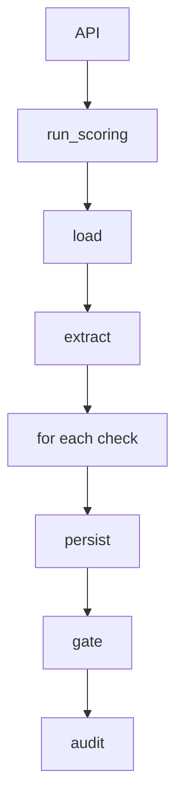

# Scoring Module

> Path: `backend/app/services/scoring/engine.py`  
> Related: [[03 Modules/Gate]], [[03 Modules/Extraction]], [[03 Modules/Check Library]]

---

## Purpose

Orchestration only — no business rules live here.

```
load lead → load transcript → resolve check versions for the call date →
extract facts once → run every check → persist results with evidence →
apply the gate → write an audit event
```

`ENGINE_VERSION = "1.0.0"`.

---

## Entry points

| Method | Path |
|--------|------|
| `POST` | `/api/v1/leads/{lead_id}/score` |
| `GET` | `/api/v1/leads/{lead_id}/results` |
| `GET` | `/api/v1/leads/{lead_id}` |
| `GET` | `/api/v1/leads` |
| `GET` | `/api/v1/leads/{lead_id}/audit` |

CLI: `python -m app.seed.run` scores every fixture. `scripts/dry_run.py` runs the pipeline in memory with LLM forced off.

## Flow

1. Lead, latest Call, Transcript, ordered Segments — else `ScoringError`.
2. Plan (optional), `checks_effective_on(retailer_id, call.started_at)`.
3. `facts.extract(segments, crm=lead.crm_fields)`.
4. Insert `ScoringRun` with `gate_decision=PENDING`.
5. For each definition: `get_handler(config.handler)`; crash → `CheckOutcome.error` (never looks like PASS).
6. `decide(lead_id, results)` → fill run scores / sample flag.
7. `Call.status = scored`. `AuditEvent` `scoring_run_completed`.

## Related Modules

| This imports | Imported by |
|--------------|-------------|
| extraction, registry, gate, version_resolver | `api/v1/scoring.py`, seed |


