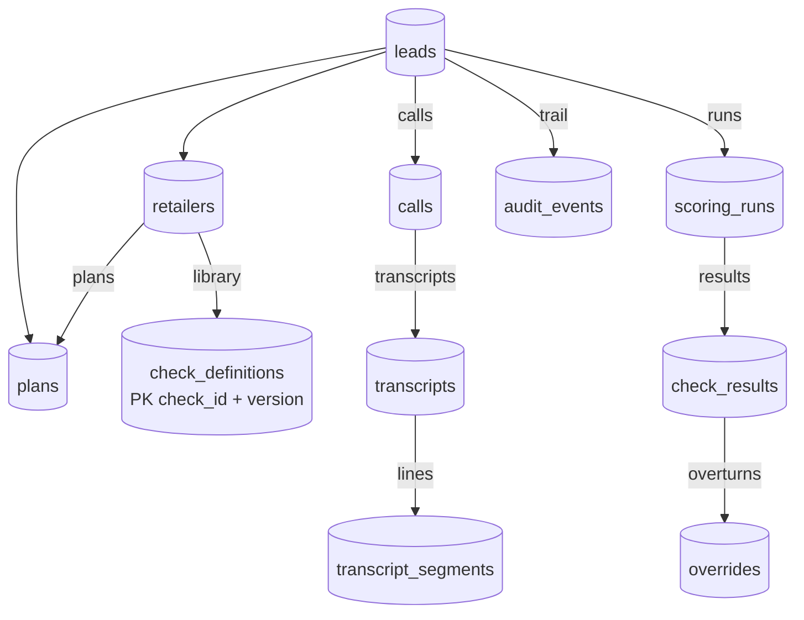

# Database Schema (relationships overview)

This note summarizes the **entity relationships** and key enums used by the QA Gate runtime.

For deeper context, see:

- [[02 Architecture/Architecture]]
- [[01 Project/Overview]]

ORM: SQLAlchemy 2.0 models in `backend/app/models/`. Tables are created by seed (`python -m app.seed.run`), not a migration series.

---

## Entity graph



---

## Key enums (`app/core/enums.py`)

- `CheckType`: `VERBATIM` | `FACTUAL` | `BEHAVIOUR`
- `CheckStatus`: `PASS` | `FAIL` | `REVIEW` | `NOT_APPLICABLE` | `ERROR`
- `GateDecision`: `AUTO_APPROVED` | `HELD` | `QA_REVIEW` | `HUMAN_SAMPLE`
- `Speaker`: `agent` | `customer` | `unknown`
- `TimingSource`: `asr` | `estimated`

`ScoringRun.gate_decision` is also written as `"PENDING"` briefly before `decide()`.

`Call.status`: `ingested` → `transcribed` → `scored`.

`CheckResult.method`: `deterministic` | `fuzzy` | `llm` | `hybrid` | `human_override`.

---

## Tables (purpose)

| Table | PK | Role |
|-------|----|------|
| `retailers` | `id` | Who owns the check library + plans |
| `plans` | `id` | Rate card — the **expected** side of factual checks |
| `leads` | `id` | Sale in CRM; `crm_fields` JSONB |
| `calls` | `id` | Recording metadata + `started_at` (drives version resolution) |
| `transcripts` | `id` | Artefact on the lead; `timing_source`, `diarization_reliable` |
| `transcript_segments` | `id` | Smallest evidence unit; `raw_text` + `redacted_text` |
| `check_definitions` | `(check_id, version)` | Versioned library + `config.handler` |
| `scoring_runs` | `id` | One gate decision per run |
| `check_results` | `id` | Status, confidence, expected/observed, evidence, trail |
| `overrides` | `id` | Before/after status **and** gate |
| `audit_events` | `id` | Append-only trail (`call_ingested`, `scoring_run_completed`, `check_result_overridden`) |

---

## Notable JSON shapes

**Lead.crm_fields** — mock identity used for comparison (email, phone, dob, addresses, `development_fee_applicable`, …).

**CheckDefinition.config** — handler name + comparison keys, e.g.:

```json
{ "handler": "money_match", "fact": "intro_price", "plan_field": "intro_price", "tolerance": 0.0 }
```

**CheckResult.evidence** — list of:

```json
{ "segment_id": "...", "text": "...", "timestamp": "14:02", "start_ms": 842000, "timing_source": "estimated", "speaker": "agent" }
```

**Segment.redactions** — findings from the redaction pass (card numbers Luhn-validated).

---

## Related

- [[03 Modules/Scoring]]
- [[03 Modules/Check Library]]
- [[09 AI Context/Concepts/Evidence contract]]
